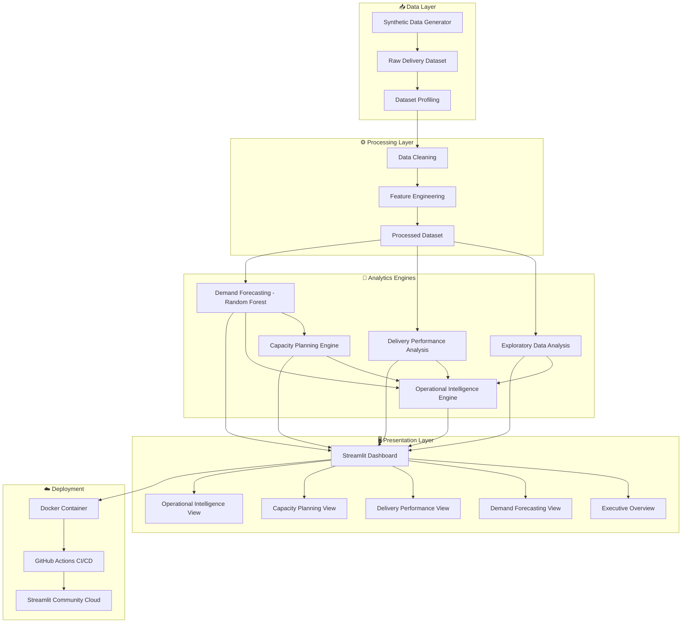
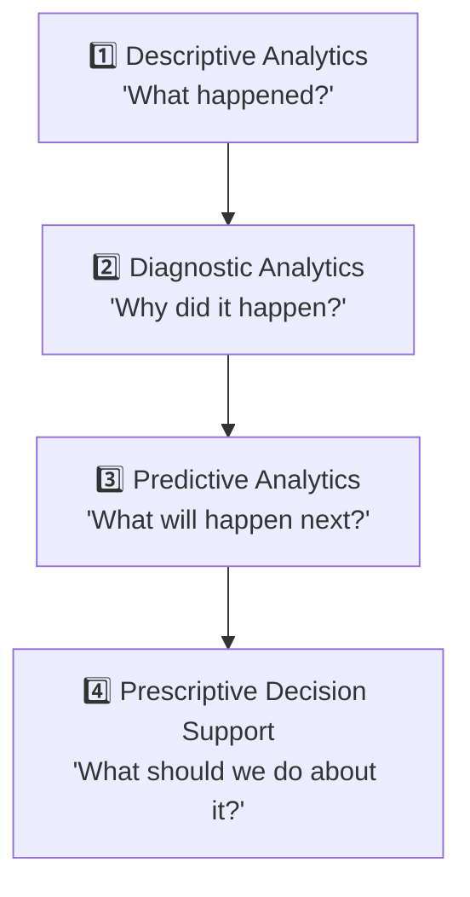
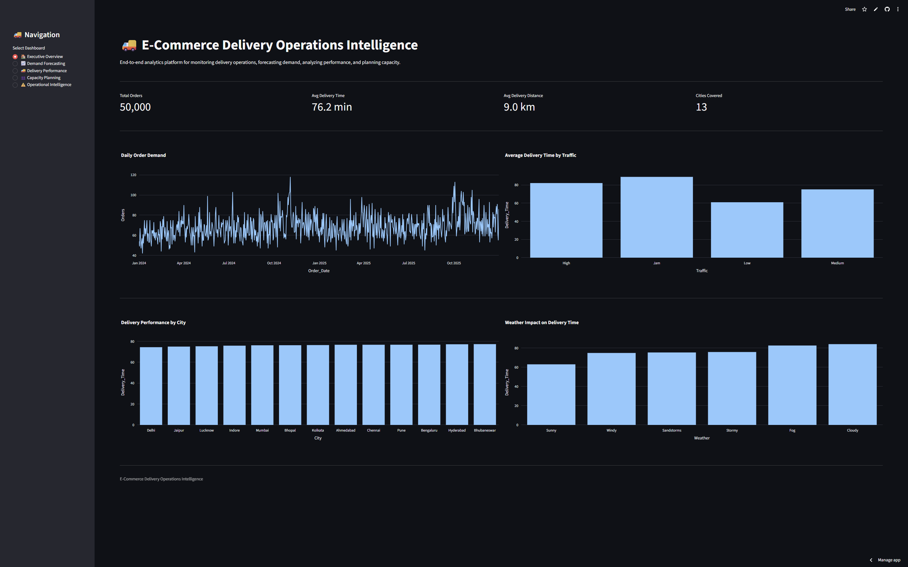
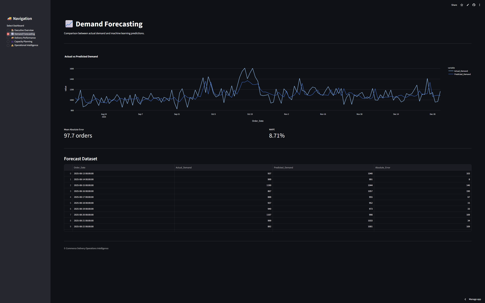
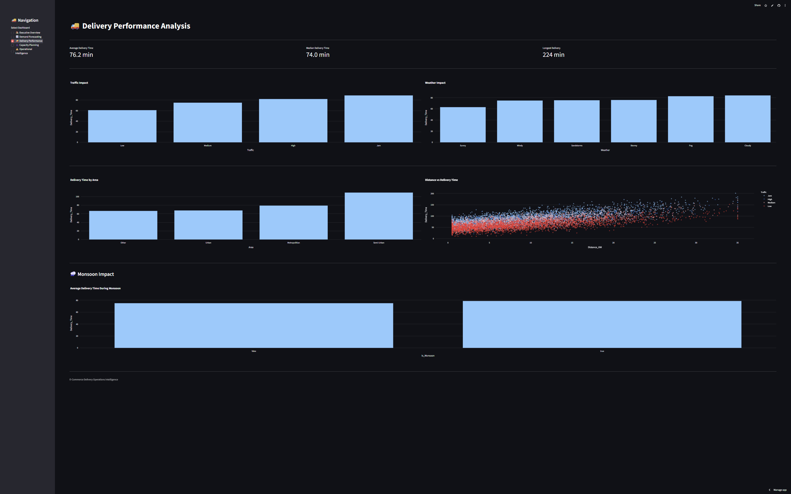
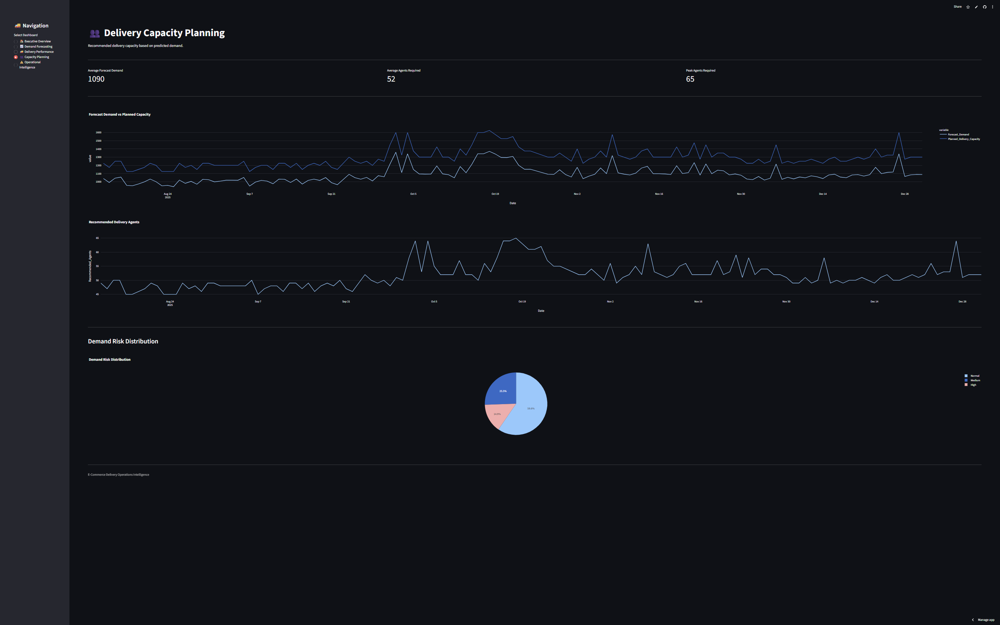
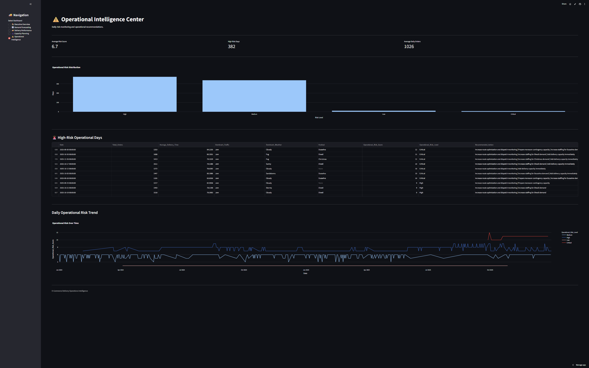

<div align="center">

# 🚚 E-Commerce Delivery Operations Intelligence

### An End-to-End Analytics Platform for Last-Mile Delivery Operations

**Descriptive → Diagnostic → Predictive → Prescriptive Analytics for E-Commerce Logistics**

[](https://www.python.org/)
[](https://streamlit.io/)
[](https://www.docker.com/)
[](https://github.com/features/actions)
[](https://scikit-learn.org/)

[](#license)
[]()
[]()

**[🔗 Live Demo](https://e-commerce-delivery-operations-intelligence.streamlit.app/)** · [📊 Features](#-key-features) · [🧠 Analytics Lifecycle](#-analytics-lifecycle) · [⚙️ Installation](#️-local-installation) · [🐳 Docker](#-docker-deployment)

</div>

---

## 📖 Table of Contents

- [Overview](#-overview)
- [Problem Statement](#-problem-statement)
- [Project Objectives](#-project-objectives)
- [Key Features](#-key-features)
- [System Architecture](#-system-architecture)
- [Data Pipeline Workflow](#-data-pipeline-workflow)
- [Analytics Lifecycle](#-analytics-lifecycle)
- [Delivery Performance Analysis](#-delivery-performance-analysis)
- [Demand Forecasting](#-demand-forecasting)
- [Capacity Planning Engine](#-capacity-planning-engine)
- [Operational Intelligence Engine](#-operational-intelligence-engine)
- [Dashboard Preview](#-dashboard-preview)
- [Technology Stack](#-technology-stack)
- [Project Structure](#-project-structure)
- [Local Installation](#️-local-installation)
- [Docker Deployment](#-docker-deployment)
- [CI/CD Pipeline](#-cicd-pipeline)
- [Cloud Deployment](#️-cloud-deployment)
- [Key Business Insights](#-key-business-insights)
- [Business Value](#-business-value)
- [Future Improvements](#-future-improvements)
- [Conclusion](#-conclusion)

---

## 🧭 Overview

**E-Commerce Delivery Operations Intelligence** is an end-to-end analytics platform that transforms raw last-mile delivery data into actionable operational insights. Rather than presenting isolated charts, the project follows a structured analytics lifecycle — moving from *what happened* to *why it happened*, then to *what will happen next*, and finally to *what should be done about it*.

The platform ingests delivery operations data, profiles and cleans it, engineers relevant features, and feeds it through a series of analytical engines covering performance diagnostics, demand forecasting, workforce capacity planning, and operational risk detection — all surfaced through an interactive Streamlit dashboard.

> This is not a static report. It is a decision-support system designed the way operations and analytics teams at logistics-driven e-commerce companies would build one internally.

---

## ❓ Problem Statement

Last-mile delivery is one of the most operationally complex and cost-intensive parts of e-commerce. Delivery delays, unpredictable demand spikes, traffic and weather disruptions, and inconsistent workforce planning directly affect customer experience and operating costs.

Most teams have access to delivery data but lack a structured way to answer the operational questions that actually matter:

- 📊 What happened in delivery operations?
- 🔍 Why did delivery performance change?
- 🌧️ What operational factors cause delays?
- 📈 What is likely to happen in future demand?
- 👥 How much delivery capacity/workforce is required?
- ⚠️ Which days or situations represent higher operational risk?

This project was built to answer exactly these questions, systematically.

---

## 🎯 Project Objectives

- Build a reliable, cleaned, and feature-engineered delivery operations dataset
- Diagnose the operational factors that drive delivery delays
- Forecast future delivery demand using historical patterns
- Translate demand forecasts into concrete workforce/capacity requirements
- Flag high-risk operational periods before they become problems
- Present all of the above through a single, unified, interactive dashboard

---

## ✨ Key Features

| Category | Capability |
|---|---|
| 🗂️ **Data Pipeline** | Dataset profiling, cleaning, feature engineering, and synthetic data generation (~750,000 records) |
| 📊 **Exploratory Analysis** | Daily, monthly, seasonal, hourly, weekday, festival, and monsoon demand analysis |
| 🚦 **Performance Diagnostics** | Delivery time breakdown by traffic, weather, city, region, area, vehicle type, and distance |
| 🔮 **Demand Forecasting** | Random Forest–based forecasting model using lag and rolling-window features |
| 👷 **Capacity Planning** | Converts forecast demand into recommended agent headcount and utilization targets |
| 🚨 **Operational Intelligence** | Combines demand, capacity, traffic, weather, and festival signals into a risk view |
| 🖥️ **Interactive Dashboard** | Five-section Streamlit application for business-facing exploration |
| 🐳 **Production Packaging** | Dockerized application with automated CI/CD and live cloud deployment |

---

## 🏗️ System Architecture



---

## 🔄 Data Pipeline Workflow

```mermaid
flowchart LR
    S1([Start]) --> S2[Generate Synthetic\nDelivery Dataset\n~750K Records]
    S2 --> S3[Dataset Inspection\n& Profiling]
    S3 --> S4[Data Cleaning]
    S4 --> S5[Feature Engineering]
    S5 --> S6[Exploratory\nData Analysis]
    S6 --> S7[Delivery Performance\nAnalysis]
    S7 --> S8[Demand Forecasting\nRandom Forest Model]
    S8 --> S9[Capacity Planning\nEngine]
    S9 --> S10[Operational\nIntelligence Engine]
    S10 --> S11[Streamlit Dashboard]
    S11 --> S12([End])
```



---

## 🧠 Analytics Lifecycle

The project is structured around a four-stage analytics lifecycle, with each stage building on the output of the previous one.



| Stage | Description | Implemented Via |
|---|---|---|
| **Descriptive** | Understand historical demand and delivery patterns | Exploratory Data Analysis module |
| **Diagnostic** | Identify what drives delivery delays and performance variation | Delivery Performance Analysis module |
| **Predictive** | Forecast future delivery demand | Random Forest demand forecasting model |
| **Prescriptive** | Translate predictions into workforce and risk decisions | Capacity Planning + Operational Intelligence engines |

---

## 🚦 Delivery Performance Analysis

The delivery performance module breaks down average delivery time across multiple operational dimensions to identify what actually drives delays.

### Impact of Traffic Conditions

| Traffic Condition | Avg. Delivery Time |
|---|---|
| 🔴 Jam | **88.78 min** |
| 🟠 High | **81.33 min** |
| 🟡 Medium | **75.08 min** |
| 🟢 Low | **60.79 min** |

### Impact of Distance

| Distance Bucket | Avg. Delivery Time |
|---|---|
| 0–2 km | 57.45 min |
| 2–5 km | 63.14 min |
| 5–10 km | 72.45 min |
| 10–20 km | 88.46 min |
| 20–35 km | **113.31 min** |

📈 **Distance vs. Delivery Time correlation: `0.6348`** — a moderately strong positive relationship, confirming distance as a significant driver of delivery time.

### Impact of Area Type

| Area Type | Avg. Delivery Time |
|---|---|
| Semi-Urban | **109.50 min** |
| Metropolitan | 78.94 min |
| Urban | 67.67 min |
| Other | 65.98 min |

Additional dimensions analyzed include **regions, delivery areas, vehicle types, monsoon periods, festival periods, and demand pressure**, giving a complete diagnostic view of delivery performance drivers.

---

## 🔮 Demand Forecasting

Future delivery demand is forecast using a **Random Forest Regressor**, trained on time-based and rolling statistical features.

### Model Features

| Feature | Description |
|---|---|
| `Lag_1` | Demand from the previous day |
| `Lag_7` | Demand from 7 days prior |
| `Rolling_Mean_7` | 7-day rolling average demand |
| `Rolling_Mean_30` | 30-day rolling average demand |
| `Day`, `Month`, `Quarter`, `Year` | Calendar-based seasonality features |
| `DayOfWeek` | Day-of-week pattern capture |
| `Is_Weekend` | Weekend demand flag |

### Model Performance

| Metric | Value |
|---|---|
| **MAE** | 97.73 orders |
| **RMSE** | 125.46 orders |
| **MAPE** | 8.71% |
| **R² Score** | 0.3114 |

> The forecast output feeds directly into the Capacity Planning Engine, closing the loop between prediction and operational decision-making.

---

## 👷 Capacity Planning Engine

The Capacity Planning Engine converts predicted demand into concrete workforce requirements using a set of defined operational assumptions.

### Operational Assumptions

| Parameter | Value |
|---|---|
| Deliveries per agent per day | 25 |
| Safety buffer | 15% |
| Target utilization | 85% |

### Engine Outputs

- 📦 Forecast demand
- 👥 Recommended delivery agents
- 🚚 Planned delivery capacity
- 📊 Expected utilization
- ⚠️ Demand risk category

This engine essentially answers the question: *"Given tomorrow's expected order volume, how many delivery agents do we actually need to stay within target utilization?"*

---

## 🚨 Operational Intelligence Engine

The Operational Intelligence Engine synthesizes signals from across the platform — demand pressure, forecast demand, capacity requirements, traffic, weather, and festival effects — to flag periods that require operational attention.

**It identifies:**

- 🔴 High-risk operational days
- 📈 Capacity stress points
- ⚡ Demand pressure spikes
- 🚧 Major operational bottlenecks

This turns disparate analytical outputs into a single, prioritized operational view rather than requiring teams to manually cross-reference multiple reports.

---

## 🖥️ Dashboard Preview

An interactive **Streamlit** dashboard brings all analytics engines together in one business-facing application, organized into five sections.

### 1️⃣ Executive Overview
High-level summary of delivery operations, demand, and performance.



### 2️⃣ Demand Forecasting
Forecasted demand trends and model performance metrics.



### 3️⃣ Delivery Performance
Delivery time breakdown across traffic, weather, distance, and area.



### 4️⃣ Capacity Planning
Recommended workforce and capacity utilization insights.



### 5️⃣ Operational Intelligence
Risk flags and operational bottleneck identification.



---

## 🛠️ Technology Stack

<div align="center">

| Layer | Technologies |
|---|---|
| **Programming & Data** | Python, Pandas, NumPy |
| **Machine Learning** | Scikit-learn (Random Forest Regressor) |
| **Visualization** | Plotly, Matplotlib, Seaborn |
| **Frontend / Dashboard** | Streamlit |
| **DevOps** | Docker, GitHub Actions |
| **Cloud Deployment** | Streamlit Community Cloud |

</div>

---

## 📂 Project Structure

```
e-commerce-delivery-operations-intelligence/
│
├── app.py                             # Streamlit application entry point
│
├── src/
│   ├── eda.py                         # Exploratory data analysis
│   ├── feature_engineering.py         # Feature engineering pipeline
│   ├── delivery_performance.py        # Delivery performance diagnostics
│   ├── demand_forecasting.py          # Random Forest demand forecasting
│   ├── capacity_planning.py           # Capacity planning engine
│   ├── operational_intelligence.py    # Operational risk engine
│   ├── profile_dataset.py             # Dataset profiling utility
│   └── synthetic/
│       ├── config.py                  # Synthetic data configuration
│       └── generate_dataset.py        # Synthetic dataset generator
│
├── data/
│   └── dashboard/
│       └── dashboard_orders.csv       # Processed dataset for dashboard
│
├── models/
│   └── demand_forecast_results.csv    # Forecasting model outputs
│
├── reports/
│   ├── figures/                       # Generated analytical figures
│   └── tables/                        # Generated analytical tables
│
├── images/
│   ├── 1.png                          # Executive Overview screenshot
│   ├── 2.png                          # Demand Forecasting screenshot
│   ├── 3.png                          # Delivery Performance screenshot
│   ├── 4.png                          # Capacity Planning screenshot
│   └── 5.png                          # Operational Intelligence screenshot
│
├── Dockerfile
├── .dockerignore
├── requirements.txt
└── README.md
```

---

## ⚙️ Local Installation

**1. Clone the repository**

```bash
git clone https://github.com/<your-username>/e-commerce-delivery-operations-intelligence.git
cd e-commerce-delivery-operations-intelligence
```

**2. Create and activate a virtual environment**

```bash
python -m venv venv
source venv/bin/activate      # On Windows: venv\Scripts\activate
```

**3. Install dependencies**

```bash
pip install -r requirements.txt
```

**4. Run the Streamlit application**

```bash
streamlit run app.py
```

The dashboard will be available at `http://localhost:8501`.

---

## 🐳 Docker Deployment

**1. Build the Docker image**

```bash
docker build -t delivery-operations-intelligence .
```

**2. Run the container**

```bash
docker run -p 8501:8501 delivery-operations-intelligence
```

The application will be available at `http://localhost:8501`.

> The `.dockerignore` file ensures unnecessary files (datasets caches, virtual environments, etc.) are excluded from the image build for a leaner container.

---

## 🔁 CI/CD Pipeline

This project uses **GitHub Actions** for continuous integration, automatically validating changes as they are pushed to the repository — helping catch issues early and keeping the deployed application in sync with the codebase.

---

## ☁️ Cloud Deployment

The application is deployed and publicly accessible via **Streamlit Community Cloud**:

<div align="center">

### 🔗 [**Launch Live Dashboard**](https://e-commerce-delivery-operations-intelligence.streamlit.app/)

</div>

---

## 💡 Key Business Insights

- 🚦 **Traffic is a major delay driver** — delivery time under "Jam" conditions (88.78 min) is nearly **46% higher** than under "Low" traffic (60.79 min)
- 📏 **Distance strongly correlates with delivery time** (correlation of 0.6348), with deliveries beyond 20 km taking nearly **2x longer** than deliveries under 2 km
- 🏘️ **Semi-Urban areas experience the slowest deliveries** (109.50 min), notably slower than Metropolitan (78.94 min) and Urban (67.67 min) areas — suggesting infrastructure or route-density gaps
- 📊 **Demand forecasting achieves a MAPE of 8.71%**, indicating reasonably reliable short-term demand prediction for operational planning
- 👥 **Capacity planning is directly demand-driven**, ensuring workforce recommendations scale with forecasted order volume rather than static staffing

---

## 💼 Business Value

This platform demonstrates how raw delivery data can be converted into a continuous operational decision-support loop:

- **Reduces reactive firefighting** by surfacing high-risk operational periods in advance
- **Supports data-driven workforce planning** instead of manual or intuition-based staffing decisions
- **Improves accountability** by quantifying which operational factors (traffic, distance, area type) actually drive delivery delays
- **Provides a single source of operational truth** for stakeholders across analytics, operations, and logistics functions

---

## 🚧 Future Improvements

> The features below are **not currently implemented** and are listed to clearly separate the current scope from potential future work.

- Real-time data ingestion instead of static/synthetic datasets
- Model experimentation beyond Random Forest (e.g., gradient boosting, time-series models)
- Hyperparameter tuning and model explainability (e.g., SHAP)
- Automated model retraining pipeline
- Role-based access control for the dashboard
- Integration with live traffic/weather APIs
- Alerting/notification system for high-risk operational days

---

## 🏁 Conclusion

**E-Commerce Delivery Operations Intelligence** demonstrates a complete, structured approach to operations analytics — from raw data to forecasting to actionable workforce and risk decisions. It is built to reflect how real operations and analytics teams would approach last-mile delivery challenges: not as isolated charts, but as a connected decision-support system.

<div align="center">

---

**⭐ If you found this project useful or interesting, consider giving it a star!**

Built with 🐍 Python, 📊 Data, and a focus on operational clarity.

[🔗 Live Demo](https://e-commerce-delivery-operations-intelligence.streamlit.app/) · [🐛 Report an Issue](../../issues) · [🤝 Contribute](../../pulls)

</div>